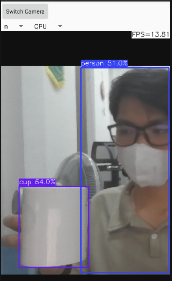

<!DOCTYPE html>
<html>

<head>
  <title>YOLOv8 Object Detection on Android</title>
</head>

<body>

  <h1>YOLOv8 Object Detection on Android</h1>

  
This project focuses on deploying YOLOv8 for real-time object detection on Android devices, leveraging the ncnn library and OpenCV.

  <h2>Inference Examples</h2>

  <ul>
    <li>YOLO in Action:
      
    </li>
    <li>PPE Classification:</li>
    <ul>
      <li>Successful Wear: Full protective glasses and masks.
        
      </li>
      <li>Lack of Protective Equipment:
        
        
      </li>
    </ul>
  </ul>

  <h2>ncnn-android-yolov8</h2>

  
This repository contains a sample Android project that relies on the <a href="https://github.com/Tencent/ncnn">ncnn library</a> and <a href="https://github.com/nihui/opencv-mobile">OpenCV</a>.

  <h3>How to Build and Run</h3>

  <h4>Step 1: Obtain ncnn Library</h4>

  <ol>
    <li>Visit <a href="https://github.com/Tencent/ncnn/releases">ncnn Releases</a>.</li>
    <li>Download <code>ncnn-YYYYMMDD-android-vulkan.zip</code> or build ncnn for Android.</li>
    <li>Extract the downloaded file into <code>app/src/main/jni</code>.</li>
    <li>Modify the <code>ncnn_DIR</code> path in <code>app/src/main/jni/CMakeLists.txt</code> to match your setup.</li>
  </ol>

  <h4>Step 2: Obtain OpenCV Mobile</h4>

  <ol>
    <li>Visit <a href="https://github.com/nihui/opencv-mobile">OpenCV Mobile Releases</a>.</li>
    <li>Download <code>opencv-mobile-XYZ-android.zip</code>.</li>
    <li>Extract the downloaded file into <code>app/src/main/jni</code>.</li>
    <li>Modify the <code>OpenCV_DIR</code> path in <code>app/src/main/jni/CMakeLists.txt</code> accordingly.</li>
  </ol>

  <h4>Step 3: Build and Enjoy</h4>

  <ol>
    <li>Open the project with Android Studio.</li>
    <li>Build the project and enjoy the YOLOv8 object detection on your Android device.</li>
  </ol>

  <h2>Notes and Considerations</h2>

  <ul>
    <li><strong>Camera Efficiency:</strong> Android NDK camera is utilized for optimal efficiency.</li>
    <li><strong>Device Compatibility:</strong> Crash incidents may occur on very old devices lacking the HAL3 camera
      interface.</li>
    <li><strong>Model Modification:</strong> All models are manually modified to accommodate dynamic input shapes.</li>
    <li><strong>Performance Insights:</strong>
      <ul>
        <li>Smaller models might run slower on GPU compared to CPU.</li>
        <li>FPS may decrease in low-light environments due to longer camera exposure times.</li>
      </ul>
    </li>
  </ul>

  <h2>Screenshots</h2>

  

  <h2>References</h2>

  <ul>
    <li><a href="https://github.com/nihui/ncnn-android-nanodet">ncnn-android-nanodet</a></li>
    <li><a href="https://github.com/Tencent/ncnn">Tencent ncnn</a></li>
    <li><a href="https://github.com/ultralytics/assets/releases/tag/v0.0.0">Ultralytics Assets</a></li>
  </ul>

  
For further details, troubleshooting, and updates, refer to the provided references and documentation. Your contributions are welcomed!

</body>

</html>
